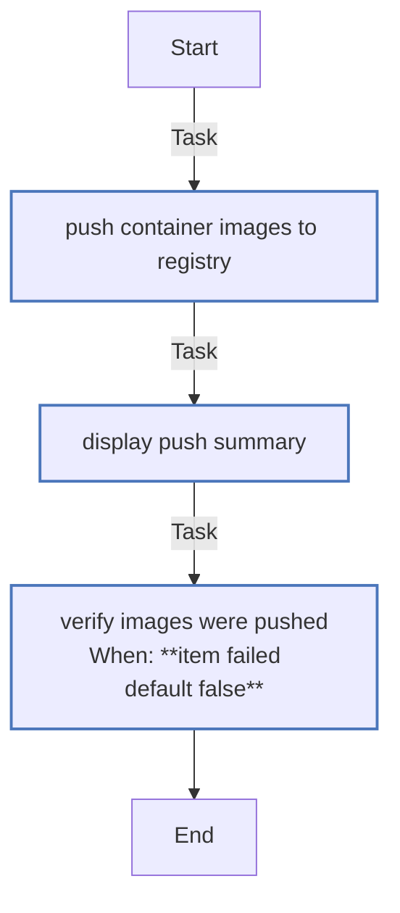
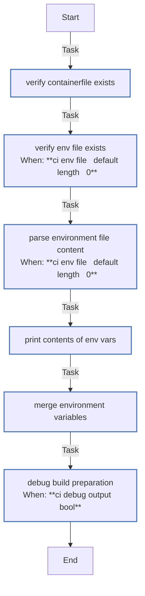
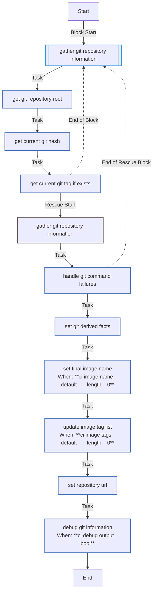
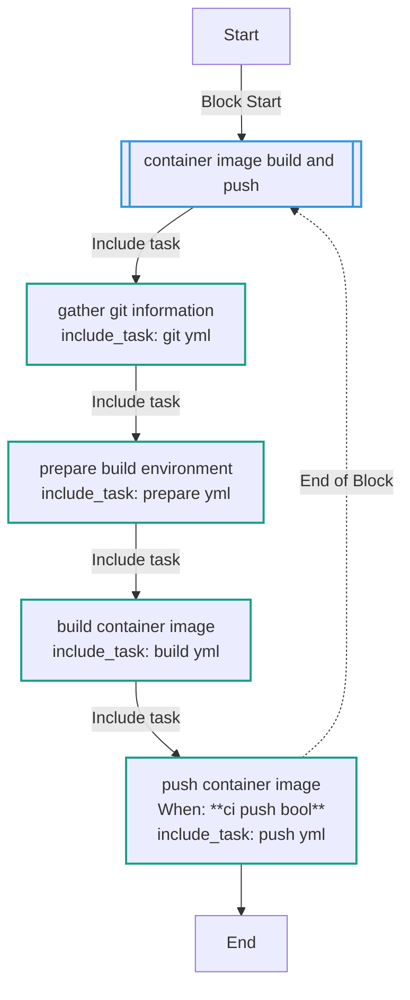
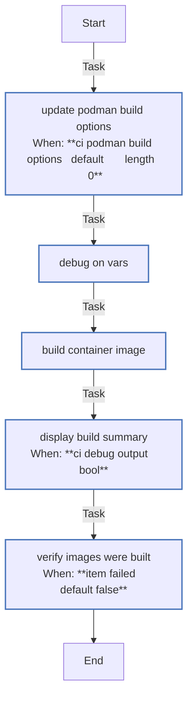

<!-- DOCSIBLE START -->

# 📃 Role overview

## container_image

Description: Build and push container images using podman

### Defaults

**These are static variables with lower priority**

#### File: `defaults/main.yml

| Var          | Type         | Value       |
|--------------|--------------|-------------|
| [ci_container_registry](defaults/main.yml#L6)   | str | `quay.io/telcov10n` |
| [ci_containerfile](defaults/main.yml#L9)   | str | `Containerfile` |
| [ci_image_name](defaults/main.yml#L12)   | str |  |
| [ci_image_tags](defaults/main.yml#L15)   | list | `[]` |
| [ci_podman_build_options](defaults/main.yml#L18)   | list | `[]` |
| [ci_podman_build_options.**0**](defaults/main.yml#L19)   | str | `--platform` |
| [ci_podman_build_options.**1**](defaults/main.yml#L20)   | str | `linux/amd64` |
| [ci_podman_extra_args](defaults/main.yml#L22)   | list | `[]` |
| [ci_build_cache](defaults/main.yml#L25)   | bool | `True` |
| [ci_build_env](defaults/main.yml#L28)   | dict | `{}` |
| [ci_env_file](defaults/main.yml#L31)   | str |  |
| [ci_push](defaults/main.yml#L34)   | bool | `True` |
| [ci_debug_output](defaults/main.yml#L37)   | bool | `False` |

### Vars

**These are variables with higher priority**

#### File: vars/main.yml

| Var          | Type         | Value       |
|--------------|--------------|-------------|
| [_git_repo_root](vars/main.yml#L6)   | str | `{{ lookup('env', 'PWD') }}` |
| [_git_current_hash](vars/main.yml#L7)   | str |  |
| [_git_current_tag](vars/main.yml#L8)   | str |  |
| [_computed_image_name](vars/main.yml#L11)   | str | `{{ ci_image_name if ci_image_name else (_git_repo_root ¦ basename) }}` |
| [_repository](vars/main.yml#L12)   | str | `{{ ci_container_registry }}/{{ _computed_image_name }}` |
| [_final_tags](vars/main.yml#L15)   | str | `{{ ci_image_tags }}` |

### Tasks

#### File: tasks/build.yml

| Name | Module | Has Conditions |
| ---- | ------ | -------------- |
| Update podman build options | ansible.builtin.set_fact | True |
| Debug on vars | ansible.builtin.debug | False |
| Build container image | containers.podman.podman_image | False |
| Display build summary | ansible.builtin.debug | True |
| Verify images were built | ansible.builtin.fail | True |

#### File: tasks/git.yml

| Name | Module | Has Conditions |
| ---- | ------ | -------------- |
| Gather git repository information | block | False |
| Get git repository root | ansible.builtin.command | False |
| Get current git hash | ansible.builtin.command | False |
| Get current git tag if exists | ansible.builtin.command | False |
| Set git-derived facts | ansible.builtin.set_fact | False |
| Set final image name | ansible.builtin.set_fact | True |
| Update image tag list | ansible.builtin.set_fact | True |
| Set repository URL | ansible.builtin.set_fact | False |
| Debug git information | ansible.builtin.debug | True |

#### File: tasks/main.yml

| Name | Module | Has Conditions | Tags |
| ---- | ------ | -------------- | -----|
| Container Image Build and Push | block | False | container,build |
| Gather git information | ansible.builtin.include_tasks | False |  |
| Prepare build environment | ansible.builtin.include_tasks | False |  |
| Build container image | ansible.builtin.include_tasks | False |  |
| Push container image | ansible.builtin.include_tasks | True |  |

#### File: tasks/prepare.yml

| Name | Module | Has Conditions |
| ---- | ------ | -------------- |
| Verify containerfile exists | ansible.builtin.stat | False |
| Verify env file exists | ansible.builtin.stat | True |
| Parse environment file content | ansible.builtin.set_fact | True |
| Print contents of _env_vars | ansible.builtin.debug | False |
| Merge environment variables | ansible.builtin.set_fact | False |
| Debug build preparation | ansible.builtin.debug | True |

#### File: tasks/push.yml

| Name | Module | Has Conditions |
| ---- | ------ | -------------- |
| Push container images to registry | containers.podman.podman_image | False |
| Display push summary | ansible.builtin.debug | False |
| Verify images were pushed | ansible.builtin.fail | True |

## Task Flow Graphs

### Graph for push.yml

### Graph for prepare.yml

### Graph for git.yml

### Graph for main.yml

### Graph for build.yml

## Author Information

eco-ci-cd team

### License

Apache-2.0

### Minimum Ansible Version

2.15

### Platforms

- **EL**: ['8', '9']
- **Fedora**: ['38', '39']

### Dependencies

No dependencies specified.
<!-- DOCSIBLE END -->
